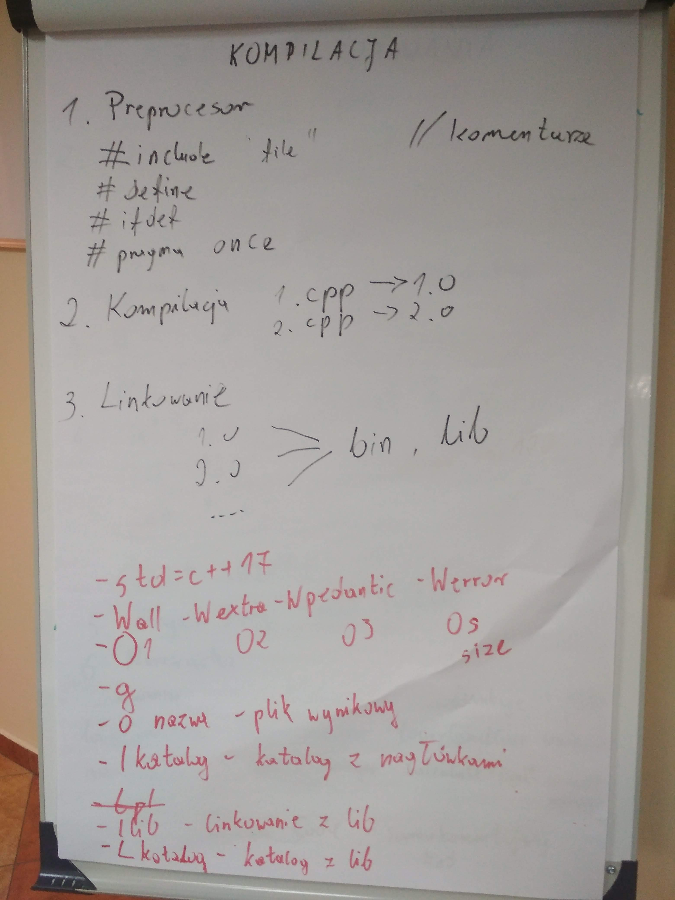
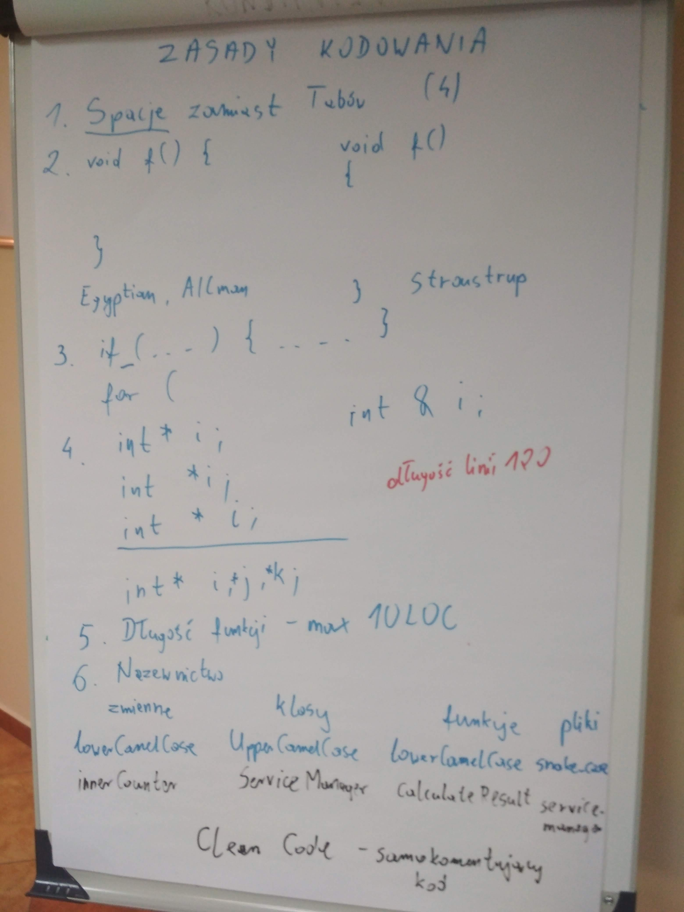
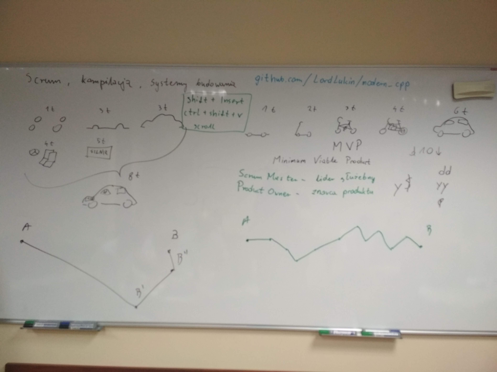
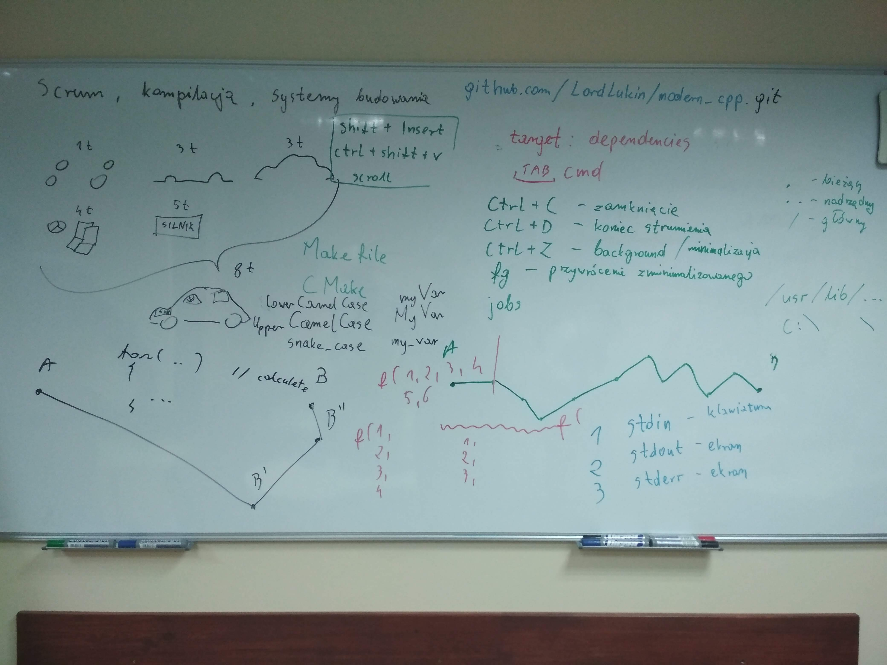

# Kurs-CPP
Materials from C++ Course at Coders School (January 2019 - March 2019)

## 14.01.2019 Narzędzia programisty (scrum, kompilacja, systemy budowania)

### Pre-work
- [X] Zapoznaj się pobieżnie ze [standardem kodowania Google](https://google.github.io/styleguide/cppguide.html) oraz [standardem kodowania LLVM](https://llvm.org/docs/CodingStandards.html). Możesz je porównać i wychwycić podobieństwa i różnice.
- [X] Poszukaj samemu informacji o tym, czym jest Makefile
- [X] Poszukaj samemu informacji o tym, czym jest Scrum
- [X] Koniecznie utwórz Pull Requesta (PR), aby powiadomić mnie o statusie Twojej pracy domowej, najlepiej gdy wykonasz wszystko. PR możesz potem aktualizować.

### Materials
- [Ściągawka - Niektóre opcje kompilacji](sciaga_opcje_kompilacji.pdf)
- [Ściągawka - Scrum](sciaga_scrum.pdf)
- [Scrum Framework](ScrumFramework.pdf)
- [Cmake documentation](https://cmake.org/cmake/help/v3.13/manual/cmake-commands.7.html)
- Foto z zajęć:  
   

### Post-work (deadline: 20.01.2019)
- [ ] Sforkuj [repozytorium modern_cpp](https://github.com/LordLukin/modern_cpp) (przycisk Fork na GitHub). Spowoduje to skopiowanie projektu na twoje konto GitHuba. Napisz poprawny Makefile do tego projektu, który wykorzystuje zmienne. Wkomituj go i udostępnij na GitHubie, zrób Pull Requesta. [Przydatny link](http://mrbook.org/blog/tutorials/make/)
- [ ] Posłuchaj [podcastu o Scrumie](http://mariuszchrapko.com/jak-scrum-wplywa-na-efektywnosci-zespolu/)
- [ ] Zrób [test Narzędzia programisty](https://goo.gl/forms/EQurphnqBaOG20U32)

### Pre-work for the next lesson (deadline 15.01.2019)
- [ ] Obejrzyj [wideo jak działa alokacja pamięci](https://www.youtube.com/watch?v=CSVRA4_xOkw)
- [ ] Obejrzyj [wideo o tym, jak działają wskaźniki](https://www.youtube.com/watch?v=W0aE-w61Cb8)
- [ ] Wpisz poniżej 3 rzeczy, które wg siebie najmniej rozumiesz w C++ i zrób Pull Request :)
  - __________
  - __________
  - __________

## 15.01.2019 Podstawy C++

### Pre-work 
- [ ] Obejrzyj [wideo jak działa alokacja pamięci](https://www.youtube.com/watch?v=CSVRA4_xOkw)
- [ ] Obejrzyj [wideo o tym, jak działają wskaźniki](https://www.youtube.com/watch?v=W0aE-w61Cb8)
- [ ] Wpisz poniżej 3 rzeczy, które wg siebie najmniej rozumiesz w C++ i zrób Pull Request :)
  - __________
  - __________
  - __________

### Materials
- [C++ keywords on cppreference.com](https://en.cppreference.com/w/cpp/keyword)
- [C++ operators on cppreference.com](https://en.cppreference.com/w/cpp/language/expressions#Operators)

### Post-work (deadline: 20.01.2019)
- [ ] Zrób [test Podstawy C++](https://goo.gl/forms/SkTtLHKSW6mWHYE13)
- [ ] **W grupach 2-3 osobowych napiszcie program, który będzie przechowywał dane o studentach.**
  Wymagania:
  - System budowania (preferowany CMake, ewentualnie Makefile)
  - Przechowywanie rekordów o strukturze: Imię, nazwisko, nr indeksu.
  - Wpisywanie nowych danych
  - Sortowanie po numerze indeksu
  - Usuwanie po numerze indeksu
  
  UWAGA: Tutaj nacisk kładziemy na pracę grupową. Każda osoba z grupy musi coś wkomitować.
  Program będzie dalej rozwijany w przyszłości. Teraz najważniejsze będzie zorganizowanie się, podzielenie pracy i commitowanie do wspólnego repozytorium
  Pamiętajcie o [MVP (Minimal Viable Product)](https://goo.gl/images/D3Jeam)
  **Podajcie linka do projektu na Discordzie, ale już w momencie jego utworzenia, a nie ukończenia!**
- [ ] Zrób ściągawkę na jeden z poniższych tematów do wyboru. Obowiązkowo daj w niej przykłady kodu:
  - stos i sterta
  - przekazywanie parametrów - kopia, wskaźnik, referencja
  - konwersje jawne i niejasne, operatory konwersji, konstruktory konwertujące, rodzaje konwersji (static, dynamic, const, reinterpret, C-style)
  - operatory (porównania, strumienia, arytmetyczne, ...)
  - słówka kluczowe - static, extern, inline, explicit, register, friend, volatile, virtual, mutable
  - wyjątki
  
  Wybrany temat **zaznacz pogrubieniem**
  Ściągę wrzuć na Discorda podziel się nią z grupą. Reszta grupy da komentarze, czy wszystko jest jasne czy nie. **Termin: 29.01.2019**.

### Pre-work for the next week (deadline: 21.01.2019)
- [ ] Zapoznaj sie bardzo ogólnie z dokumentacja C++: http://en.cppreference.com/w/
- [ ] Przeczytaj artykuł mojego kolegi Marcina Pietraszka o złożoności obliczeniowej: http://www.samouczekprogramisty.pl/podstawy-zlozonosci-obliczeniowej/
- [ ] Zapoznaj sie dokładniej z opisem kontenerów: http://en.cppreference.com/w/cpp/container
- [ ] Playlista na YT odnośnie STLa: https://www.youtube.com/playlist?list=PL5jc9xFGsL8G3y3ywuFSvOuNm3GjBwdkb - obejrzyj ile mozesz :)

